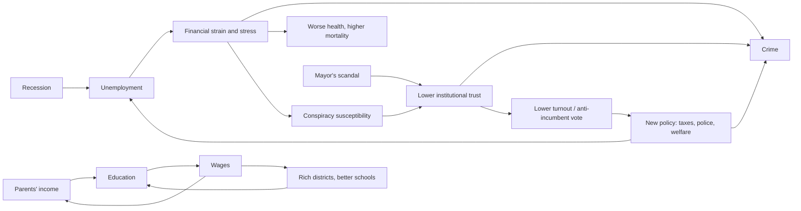

# Civitas

**An agent-based simulation of a human society, in which individual behaviour
is written as explicit, research-grounded equations and society-wide patterns
are left to emerge.**

Each of the ~600 founding citizens (and the ~300 born over 40 simulated years)
has inherited personality traits, a social network, a job, money, health,
political views and beliefs. Every month they meet people, decide whether to
cooperate or exploit, gossip, argue about politics, look for work, fall in
love, commit or suffer crimes, vote, get sick and die. Nobody scripts the
outcome: inequality, crime waves, echo chambers, conspiracy theories,
corruption scandals and social (im)mobility all arise from the individual
equations.

```text
$ python main.py --seed 42
...
Year   6 | pop  652 | unemp  5.4% | Gini(w) 0.60 | crime/1k  30.7 | trust 0.45 | polar 0.49 | LS 7.53 | e0 79.3
  [Year  7, month  9] SCANDAL: Mayor Ruth Tanaka is caught embezzling $928,616 of public money.
  [Year  7, month  9] Mayor Ruth Tanaka leaves office (convicted).
  [Year  7, month 10] Tomas Lee (right, +0.59) wins the special election with 46%; turnout 36%.
Year   7 | pop  658 | unemp  4.5% | Gini(w) 0.58 | crime/1k  15.2 | trust 0.28 | polar 0.48 | LS 7.44 | e0 78.3
Year   8 | pop  662 | unemp  4.7% | Gini(w) 0.57 | crime/1k  39.3 | trust 0.35 | polar 0.48 | LS 7.44 | e0 78.9
```

In that run, a corrupt mayor's scandal collapses trust in institutions (0.45 → 0.28), and property crime more than doubles the next year (15 → 39 per 1,000). No rule says "scandals cause crime". It follows from each person's crime decision including a legitimacy term (people obey institutions they trust; Tyler 1990).

## Quick start

**No typing needed:** double-click **`Civitas.bat`** for a menu of runs, scenarios, studies and a
guided "build your own society". Every result opens automatically in your browser on localhost,
and `out/index.html` lists every saved result. What each option does is explained in
**[MY_OWN_MIX_GUIDE.txt](MY_OWN_MIX_GUIDE.txt)**.

From a terminal instead:

```bash
pip install -r requirements.txt       # numpy (+ pytest for the tests)
python main.py                        # 40-year run -> report, dashboard, interactive dossiers
```

```bash
python main.py run --seed 7 --years 60 --population 800 --save out/sim.pkl
python main.py run --set policy.ubi=600 --set crime.deterrence=5    # change any parameter
python main.py --scenario collapse                                  # preset: selfish people, open-access resource
python main.py --trait honesty=-0.5 --rule equal_shares             # your own mix of behaviour and rules
python main.py scenarios                                            # list the presets
python main.py levers                                               # which factors cause a boom or a collapse?
python main.py commons                                              # the research question (below)
python main.py explore out/sim.pkl                                  # look anyone up later
python main.py experiment --seeds 8                                 # compare policy regimes with 95% CIs
python -m pytest                                                    # tests
```

## Growth, decline and collapse

Every run ends with a verdict: **rapid growth, growth, stagnation, decline or
collapse**. It is based on the **Civitas Development Index**, a UN-HDI-style
geometric mean of health, knowledge, living standard, equality, cohesion
(trust, cooperation, safety) and sustainability (the state of the shared
resource). The report and dashboard then explain the verdict:

* **Productivity is endogenous.** Each year it grows or shrinks with the
  population's schooling, curiosity and ability, everyday cooperation, trust in
  institutions, public investment, crime, corruption and resource scarcity.
  All of these are measured on the simulated people themselves.
* **Boost / suppress.** Each factor's cumulative contribution to growth is
  ranked and mapped to the real-world area it represents, for example
  "Resource scarcity: manage shared resources sustainably" or "Education and
  skills: widen access to education".
* **What-if levers.** `python main.py levers` pushes each of 12 factors from a
  low to a high setting on the same seeds:
  * six policies: education, public services, policing, welfare,
    mental-health care, top tax
  * four personality traits of the population: honesty, agreeableness,
    conscientiousness, curiosity
  * resource regrowth and resource governance

  It measures the change in development, growth, income, inequality,
  resources and collapse risk, and writes a ranked "tornado" report
  (`out/levers/levers_report.html`) showing which parts of society to boost
  and which to suppress.
* **Scenario presets** such as `boom`, `collapse`, `tragedy_of_the_commons`,
  `ostrom`, `corruption` and `knowledge_economy` combine behaviour and rules.
  Try `python main.py --scenario boom` and `--scenario collapse` and compare
  the dashboards.

## Research question: behaviour, rules and shared resources

> *How do different individual behaviours and resource-allocation rules affect
> inequality and resource availability in a community over time?*

The town shares a renewable resource (a fishery, farmland or forest) that
regrows logistically. How much each person takes depends on their honesty,
agreeableness and desperation, and whether they respect a quota depends on
honesty, trust and enforcement. Five allocation rules decide who gets the
output:
* open access
* regulated quota
* equal shares
* need-based
* private ownership

`python main.py commons` runs every rule against cooperative, average and
selfish populations. It reports resource stock, resource income per adult,
Gini coefficients, poverty and collapse, with time-path charts and an
inequality-versus-resources scatter. Design, hypotheses (Hardin's tragedy of
the commons vs. Ostrom's self-governance) and how to read the results are in
**[docs/RESEARCH_QUESTION.md](docs/RESEARCH_QUESTION.md)**.

Each run writes an **interactive dashboard**, `out/civitas_seed42.html`, a
single self-contained page with about 30 charts, an interactive social-network map,
the election history, and a searchable register of everyone who ever lived.
Each person has a dossier with their traits, life story, net-worth and
happiness curves, and timeline.

## How a person works

Every decision is a *random-utility* choice, `P(act) = σ(U)`, where `U` adds up
signed, interpretable terms taken from the research literature. For example,
the decision to cooperate with someone:

```
U = 1.1 + 0.8·honesty + 0.5·agreeableness + 2.0·(2·trust − 1) + 1.0·closeness
        + 0.25·ln(1 + mutual friends) − 0.45·stress − 0.6·financial strain
```

and the decision to commit a property crime (Becker 1968; Tyler 1990):

```
U = −7.5 + 1.8·strain + 0.7·unemployed − 0.9·honesty − 0.45·self-control + 0.8·[age 15–29]
        + 2.0·delinquent peers − 3.0·P(arrest)·P(conviction)·sentence − 1.2·(2·institutional trust − 1)
```

The full specification, with every equation, parameter and citation, is in
**[docs/MODEL.md](docs/MODEL.md)**.

| Layer | Model (source) |
|---|---|
| Personality | HEXACO six factors + cognitive ability, as z-scores (Ashton & Lee 2007) |
| Heredity | Fisher's infinitesimal model; parent–offspring slope = h² (tested) |
| Trust | Discounted Beta–Bernoulli learning (Jøsang & Ismail 2002) |
| Cooperation | Network Prisoner's Dilemma with direct + indirect reciprocity, gossip (Nowak & Sigmund 1998) |
| Network | Homophily, triadic closure, tie decay, Dunbar cap, "unfriending" (McPherson et al. 2001) |
| Opinions | Bounded confidence with backfire, Friedkin–Johnsen stubbornness (Deffuant 2000) |
| Misinformation | Predisposition × exposure, peer + media contagion, debunking (Uscinski et al. 2016) |
| Wages | Mincer earnings equation, 8% return per year of schooling (Psacharopoulos & Patrinos 2018) |
| Jobs | Search and matching, recessions (Hamilton 1989), weak-tie job leads (Granovetter 1973) |
| Wealth | Buffer-stock consumption (Carroll 1997); Kesten multiplicative returns give a Pareto tail |
| Crime | Becker expected utility, differential association, legitimacy; police, bribes, courts, prison |
| Well-being | Allostatic stress, stress-diathesis crises with treatment, hedonic adaptation (OU process) |
| Mortality | Gompertz–Makeham with health-dependent frailty (the socioeconomic gradient emerges) |
| Family | Assortative partnering, relationship quality and divorce, age-specific fertility, inheritance |
| Politics | Probabilistic spatial voting, ideology-driven policy, embezzlement and scandals, fiscal rule |
| Shared resource | Logistic regrowth, Schaefer harvesting, quotas and compliance, 5 allocation rules (Hardin 1968; Ostrom 1990) |
| Growth | Endogenous productivity from human capital, trust, institutions, crime, corruption, scarcity (Barro 1991; Knack & Keefer 1997) |
| Development | UN-HDI-style composite index and a growth/stagnation/decline/collapse verdict |

## What emerges



None of these relationships is hard-coded at the level of society. In a typical 40-year run:

* **Inequality** settles at a wealth Gini of ~0.6. The richest 10% hold ~42% of
  wealth, and a Pareto-like tail forms from multiplicative investment returns.
* **Social mobility**: the rank-rank slope between parents' and children's
  income is ~0.16–0.2, close to Denmark (0.18) and well below the USA (0.34).
  It arises from heredity, parental income, credit constraints on university,
  district schools, inheritance and networks.
* **Echo chambers**: the correlation of political views between friends rises
  from ~0.25 to ~0.35–0.40 within a decade, through influence plus
  "unfriending".
* **Crime** concentrates among young, low-honesty, financially strained people
  with delinquent friends. About 35–45% of released prisoners are reconvicted
  within 3 years.
* **Corruption matters**: low-honesty mayors skim public money. When a scandal
  breaks, trust collapses, conspiracy beliefs spike and a special election
  follows.
* **What predicts a high income?** A regression run on the simulated
  population finds education dominates (standardised β ≈ 0.4); extraversion
  and conscientiousness add a little. Intelligence barely appears on its own,
  because its effect runs almost entirely *through* education. Together these
  explain only ~20–25% of the variance: luck, recessions and who you know do
  the rest.

## Policy experiments

`python main.py experiment --seeds 8` runs five policy regimes on the same
eight random seeds, 40 years each, with policy locked so elections cannot
change it. The flat income tax adjusts automatically to keep each regime
solvent, so the tax rate each regime *needs* is itself a result.

> **Note:** the tables below were produced with version 1.0, before the shared
> resource and endogenous growth were added in 1.1. Re-run
> `python main.py experiment --seeds 8` to regenerate them for the current model.

**Levels** (mean ± 95% confidence interval over 8 seeds, 500 founders, 40 years):

| Regime | Wealth Gini | Poverty | Mobility slope | Unemployment | Property crime /1k | Prisoners /100k | Life satisfaction | Tax rate needed |
|---|---|---|---|---|---|---|---|---|
| Baseline | 0.607 ± 0.018 | 12.0% ± 0.9% | 0.16 ± 0.04 | 5.5% ± 0.3% | 25.0 ± 1.6 | 490 ± 109 | 7.42 ± 0.04 | 24.5% ± 1.0% |
| Laissez-faire | 0.624 ± 0.019 | 16.0% ± 0.6% | 0.18 ± 0.05 | 6.0% ± 0.4% | 28.9 ± 3.8 | 673 ± 212 | 7.37 ± 0.04 | 18.8% ± 0.9% |
| Nordic | 0.588 ± 0.014 | 10.8% ± 1.0% | 0.15 ± 0.08 | 5.5% ± 0.3% | 27.2 ± 2.9 | 459 ± 61 | 7.45 ± 0.03 | 30.4% ± 1.4% |
| Tough on crime | 0.593 ± 0.023 | 12.1% ± 1.2% | 0.12 ± 0.08 | 5.5% ± 0.4% | 9.0 ± 1.1 | 944 ± 123 | 7.42 ± 0.05 | 25.6% ± 1.1% |
| Universal basic income | 0.545 ± 0.010 | 12.1% ± 1.3% | 0.10 ± 0.08 | 5.4% ± 0.4% | 25.6 ± 2.2 | 498 ± 142 | 7.52 ± 0.05 | 39.4% ± 1.5% |

**Differences from baseline, paired by seed.** Every regime ran on the same
eight seeds, so subtracting within a seed cancels much of the run-to-run noise
(a paired t-test). \* marks a 95% interval that excludes zero.

| Regime | Wealth Gini | Poverty | Mobility slope | Property crime /1k | Prisoners /100k | Life satisfaction | Tax rate needed |
|---|---|---|---|---|---|---|---|
| Laissez-faire | +0.017 ± 0.024 | **+4.0% ± 0.6%\*** | +0.02 ± 0.04 | +3.8 ± 4.2 | +183 ± 207 | −0.05 ± 0.06 | −5.6% ± 0.9%\* |
| Nordic | −0.019 ± 0.015\* | −1.2% ± 1.4% | −0.01 ± 0.10 | +2.2 ± 3.0 | −32 ± 116 | +0.03 ± 0.03\* | +5.9% ± 1.0%\* |
| Tough on crime | −0.014 ± 0.017 | +0.1% ± 1.6% | −0.04 ± 0.08 | **−16.0 ± 1.7\*** | **+453 ± 142\*** | +0.00 ± 0.05 | +1.1% ± 0.7%\* |
| Universal basic income | **−0.062 ± 0.019\*** | +0.0% ± 1.2% | −0.06 ± 0.09 | +0.6 ± 1.5 | +8 ± 134 | +0.10 ± 0.05\* | **+14.9% ± 0.9%\*** |

What the model says:

* **Tough on crime** (twice the police, longer sentences, more custody) cuts
  property crime by nearly two thirds, but almost doubles the prison
  population.
* **Laissez-faire** saves about 6 points of tax but raises the poverty rate
  from 12% to 16%.
* **Universal basic income** ($700/month to every adult) gives by far the
  lowest inequality and a small rise in life satisfaction, at the price of a
  15-point higher flat tax. This model has no labour-supply response to taxes
  or UBI, which is the main economic argument against it, so these results are
  an upper bound on its benefits.
* **Nordic** spending costs about 6 tax points and buys slightly lower
  inequality and slightly higher life satisfaction.
* **Mobility** differences point the way the "Great Gatsby curve" predicts
  (the more unequal laissez-faire regime is slightly less mobile, UBI slightly
  more), but none is statistically distinguishable from zero with eight runs.
  Detecting them would take more seeds or larger towns.
* The full table (`out/experiments/experiment_summary.md`) tests 12 outcomes
  for each of 4 regimes. At a 95% level, two or three of those 48 comparisons
  are expected to look "significant" by chance alone, so isolated marginal
  results deserve caution.

Raw runs are saved to `out/experiments/` (CSV and JSON).

## Project structure

```
civitas/
  config.py        every parameter, with sources (JSON load/save, --set overrides)
  traits.py        HEXACO personality + ability, infinitesimal-model inheritance
  person.py        the agent and its ties
  network.py       tie creation, decay, homophily, social support
  social.py        interactions: cooperation game, trust, gossip, opinions, rumours
  economy.py       schooling, labour market, wages, taxes, welfare, consumption, ledger
  crime.py         offending, policing, bribery, courts, prison, recidivism
  wellbeing.py     health, stress, trauma, crises, life satisfaction
  demography.py    founding population, mortality, partnership, fertility, inheritance, moving house
  politics.py      trust in institutions, elections, policy, corruption, fiscal rule
  resources.py     the shared renewable resource (commons): harvesting behaviour, quotas, 5 allocation rules
  development.py   development index, endogenous productivity growth, growth/decline/collapse verdict
  scenarios.py     named presets of behaviour and rules (boom, collapse, tragedy of the commons, ...)
  studies.py       lever (sensitivity) analysis and the commons study, with HTML reports
  metrics.py       Gini, Lorenz, life tables, mobility, polarisation, segregation, OLS
  simulation.py    the monthly engine and yearly statistics
  report.py        console report, leaderboards, auto-written biographies, dossiers
  dashboard.py     self-contained interactive HTML dashboard
  experiments.py   multi-seed policy experiments with confidence intervals (multiprocessing)
main.py            command-line interface
tests/             35 tests: accounting identities, genetics, behavioural equations, invariants
docs/MODEL.md      the full mathematical specification
docs/ORIGINAL_CODE_REVIEW.md   what was wrong with the first prototype, and how it was fixed
docs/RESEARCH_QUESTION.md      the commons study: design, hypotheses, how to run and read it
```

## Engineering notes

* **Money is conserved.** Every dollar moves through either a zero-sum
  `transfer` or a logged `external` flow, and a test checks the
  stock-flow identity to floating-point precision.
* **Reproducible.** One seeded RNG drives everything; the same seed gives the
  same history.
* **Fast enough to experiment with.** A 40-year run of ~900 lives and over a
  million interactions takes ~40 s in pure Python. Two techniques make that
  possible. Weighted partner selection uses per-month cumulative-weight tables
  with binary search (O(log k) instead of O(k)). The crime decision uses an
  exact rejection shortcut, so the costly peer-network scan only runs when the
  random draw could possibly produce a crime. Experiments run in parallel
  across CPU cores.
* **Tested at three levels:** unit tests of the metrics against textbook values,
  directional tests of each behavioural equation, and whole-simulation
  invariants (mutual partnerships, a consistent social graph, prison
  bookkeeping, plausible outcomes).

## From prototype to model

The project started as a single 300-line script
([oldv.py](oldv.py)). Running it showed that its most "politically powerful"
citizens were exactly its most prolific liars, that nobody over 22 ever got a
job, that money was created from nothing, that children died in debt, and that
prison sentences lasted days.

## Limitations

This is a model, not a forecast. Parameters come from the literature or were
calibrated by hand against stylised facts, not estimated from micro data. Among
the simplifications:
* one town, with no migration
* no housing market, firms-as-agents or inflation
* a single left–right political dimension and a single conspiracy theory
* people cannot choose how many hours to work, so a UBI has no labour-supply
  effect here

Personality shifts probabilities; it never determines outcomes. See §12 of
[MODEL.md](docs/MODEL.md) for more.
